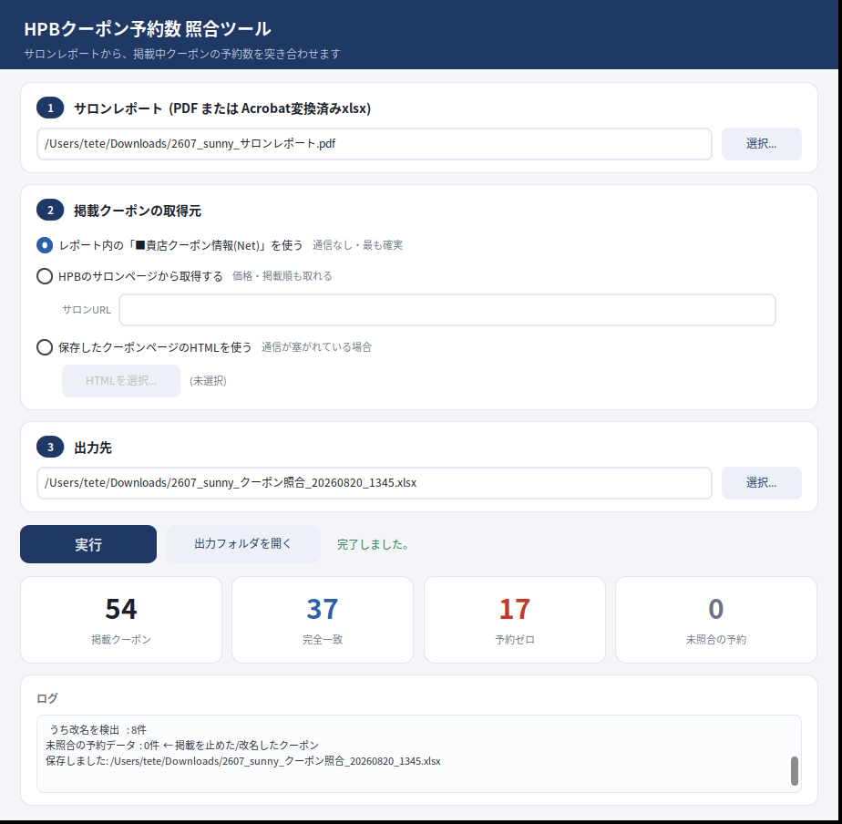

# HPBクーポン予約数 照合ツール

サロンボードのレポートから「いま掲載しているクーポンが何件予約されているか」を出すツール。
サーバーは立てず、自分のPCの中だけで完結する。

これまで手作業でやっていた

1. レポートPDFをAdobe Acrobatでxlsx化
2. HPBのサロンページからクーポン情報をスクレイピングしてxlsx化
3. 2つのxlsxを一致率で並べ替えて目視で突き合わせる

を、**ファイルを1つ選んで「実行」を押すだけ**にまとめたもの。

---

## 使い方



### 起動

**方法A: 単体アプリを使う（推奨。Pythonのインストール不要）**

GitHubの Actions → `Build HPB coupon report app` → 最新の実行 → Artifacts から
自分のOS向けをダウンロードする。中身は実行ファイル1つだけ。

| OS | Artifact | 使い方 |
| --- | --- | --- |
| Windows | `hpb-coupon-report-windows` | `hpb-coupon-report.exe` をダブルクリック |
| macOS (Apple Silicon / M1以降) | `hpb-coupon-report-macos-applesilicon` | 下記参照 |
| macOS (Intel) | `hpb-coupon-report-macos-intel` | 下記参照 |
| Linux | `hpb-coupon-report-linux` | `chmod +x` して実行 |

自分のMacがどちらかは、左上のリンゴマーク →「このMacについて」で確認できる
（チップが **Apple M1/M2/M3…** なら Apple Silicon、**Intel Core…** なら Intel）。

**macOSでの手順**

```bash
# Artifactのzipを展開すると tar.gz が出てくるので、それを展開する
tar -xzf hpb-coupon-report-macos.tar.gz
# ダウンロード時に付く隔離属性を外す(これをしないと「壊れている」と言われる)
xattr -dr com.apple.quarantine hpb-coupon-report.app
open hpb-coupon-report.app
```

Artifactのzipでは実行権限が落ちてしまうため、macOS版は`.app`をtarで固めて配っている。

> **初回起動時に警告が出ます。** コード署名をしていないため、
> Windowsでは「WindowsによってPCが保護されました」→ **詳細情報** → **実行**、
> macOSでは上記の `xattr` を実行するか、右クリック → **開く** → **開く**。
> （署名するには有料のApple Developer Program登録が必要なので、
> 社内利用の範囲では未署名のままにしている）

ファイル名は自由に変えてよい（例: `クーポン照合.exe`）。中身は1ファイルで完結している。

**方法B: ソースから起動する**

| OS | 手順 |
| --- | --- |
| Windows | `run.bat` をダブルクリック |
| macOS / Linux | ターミナルで `./run.sh` |

初回だけ `.venv` を作って必要なライブラリを入れる（1〜2分）。2回目以降はすぐ起動する。

### 自分でビルドする

| OS | 手順 |
| --- | --- |
| Windows | `build.bat` をダブルクリック → `dist\hpb-coupon-report.exe` |
| macOS / Linux | `./build.sh` → `dist/` |

PyInstallerでonefile（単一の実行ファイル）にしている。月に一度使う道具なので、
起動が数秒遅くなるより「1つのファイルを置くだけ」のほうが扱いやすいという判断。
UPX圧縮はウイルス対策ソフトの誤検知を招きやすいので使っていない。

アイコンを作り直したいときは `python assets/make_icon.py`。

### 画面の流れ

1. **サロンレポート**を選ぶ（`.pdf` そのまま、または Acrobat変換済みの `.xlsx`）
2. **掲載クーポンの取得元**を選ぶ（下記参照）
3. **出力先**を確認する（レポートと同じフォルダに自動で入る）
4. **実行**

### 掲載クーポンの取得元は3つから選べる

| 選択肢 | 通信 | 価格・掲載順 | 備考 |
| --- | --- | --- | --- |
| レポート内の「■貴店クーポン情報(Net)」 | なし | 取れない | **既定。最も確実。** 実データで掲載54件を100%取得できた |
| HPBのサロンページから取得 | あり | 取れる | 価格つきで出したいとき |
| 保存したHTMLを使う | なし | 取れる | 社内ネットワークでHPBが塞がれている場合の逃げ道 |

レポートPDFの中には**掲載クーポン一覧と予約数の両方**が入っている。
つまり **PDF 1ファイルだけで照合が完結する**。スクレイピングは価格・掲載順を足したいときの上乗せ。

> レポート内の一覧は「登録数順の上位60件まで」という制限がある。
> 掲載クーポンが60件を超えるサロンでは取りこぼす可能性があるため、
> 60件に達している場合はツールが警告を出す。その場合はスクレイピングを使う。

---

## 出力されるxlsx

| シート | 内容 |
| --- | --- |
| **照合結果** | 掲載クーポン全件 × 予約数。予約が多い順。予約ゼロは赤、あいまい一致は黄で色分け。掲載履歴の列（下記）付き |
| **予約ゼロ** | 掲載中なのに予約実績が無いクーポン。**差し替え・書き換えの検討対象** |
| **未照合の予約** | 予約はあるが現在の掲載に無いもの。掲載を止めた／名前を変えたクーポン。最終掲載月号と改名候補の列付き |
| **要確認** | 完全一致しなかった対応だけを集めたもの。ここだけ目視すればよい |
| **実行情報** | いつ・どのファイル・どこから取得したか、件数の内訳、警告 |

予約数は **3ヶ月合計と各月号の両方**を出す（例: `05月号` `06月号` `07月号` `予約数合計`）。
月ごとの列を見れば、伸びているクーポンと落ちているクーポンを見分けられる。

### 掲載履歴の列

レポートの「■貴店クーポン情報(Net)」は**月号ごとの列**を持っていて、各列がその月の
掲載クーポン一覧になっている（実物では6ヶ月分）。ここから次の列を出す。

| 列 | 内容 |
| --- | --- |
| `掲載状況` | `継続` / `新規掲載` / `改名` |
| `初掲載月号` | いつから載っているか。改名していれば改名前まで遡る |
| `旧クーポン名` `旧名の月号` `改名の一致率` | 改名を検出した場合の変更前の名前 |

「未照合の予約」側には `最終掲載月号`（いつまで載っていたか）と
`改名候補(現在の掲載)` が付く。

---

## コマンドラインから使う

```bash
# レポートだけで照合（通信なし）
python cli.py --report サロンレポート.pdf

# HPBから価格・掲載順も取ってくる
python cli.py --report レポート.xlsx --url https://beauty.hotpepper.jp/slnH000548746/

# 保存したHTMLを使う
python cli.py --report レポート.pdf --html coupon1.html coupon2.html --out 結果.xlsx
```

---

## 仕組み

### レポートの読み取り（`report_pdf.py` / `report_xlsx.py` / `report_grid.py`）

PDFもxlsxも、いったん **`list[list[str]]` のセル格子**に変換してから同じコードで解析する。
Acrobatのxlsx変換がやっているのは「PDFの文字を座標に従ってセルに置くこと」なので、
PDFから同じ格子を組み立てれば、xlsxで検証済みのロジックがそのまま効く。

レポートは月号ごとに行・列がずれるため、座標は決め打ちしない。
`■クーポン別ネット予約数` という見出しをアンカーにして相対的に読む。
同じ行に並ぶ `■` がセクションの横方向の区切りになる。

### クーポン名の正規化（`normalize.py`）— ここが精度の要

掲載側とレポート側の食い違いは、**クーポンの中身の違いではなく PDF由来の表記ゆれ**だった。

| ゆれ | 掲載側 | レポート側 |
| --- | --- | --- |
| 円記号 | `￥13500` | `\13500` |
| 接頭タグ | なし | `[指定]` `[平日]` が付く |
| 全角/半角 | `［髪質改善］` | `[髪質改善]` |
| 空白 | `\11000  ［髪質改善］` | `\11000［髪質改善］` |

NFKC正規化＋円記号の統一＋接頭タグ除去＋空白除去を通したところ、
**2026年07月号の実データで予約データ37件すべてが完全一致した（一致率1.000）**。

つまり「一致率で並べ替えて目視で確認する」作業は、通常運用ではほぼ不要になる。

### 照合（`matching.py`）

1. **正規化キーの完全一致**を先に確定させる
   似た名前のクーポン（`メンズカット\5500` と `メンズカット\5500→\4500`）が
   入れ替わる事故を防ぐため、確実な一致から先に抜く
2. **残りをレーベンシュタイン距離＋ハンガリー法**で1対1に割り当てる
   「予約行ごとに最も似た掲載行を選ぶ」貪欲法だと同じ掲載クーポンに複数の予約行が
   ぶら下がるが、ハンガリー法は一致率の総和が最大になる組み合わせを選ぶので
   1対1が保証される。クーポン名を書き換えた月でも対応関係が崩れにくい
3. 一致率が閾値（既定 0.55）未満の組み合わせは「対応なし」として切り捨てる

なお、**レポート1枚の中では改名は問題にならない**。予約数の表は「クーポン名1列＋月号3列」
という作りで、HPB側が既にクーポンの同一性を解決したうえで1つの名前に3ヶ月分をまとめている。
実データでも、各月に予約実績のあるクーポンは全件その月の掲載一覧に存在した
（05月号29件／06月号32件／07月号37件、いずれも不一致0件）。

### 改名の検出（`pipeline.py`）

掲載履歴の隣り合う月号を比べ、「消えた名前」と「現れた名前」をハンガリー法で1対1に
対応づける。ここでも貪欲法は使わない（実データで試したところ、1つの旧名が3件の
別クーポンの旧名として使い回された）。

改名とみなす一致率の下限は **0.75**。実データの02月号→03月号の一斉リニューアル
（22件入れ替え）で測って決めた値で、この境界の上下ははっきり分かれる。

| 一致率 | 旧名 → 新名 | 判定 |
| --- | --- | --- |
| 0.971 | `Aujua4ste/` → `Aujua4step/` | 誤植修正 |
| 0.947 | `カット+ブリーチ+カラー` → `カット+ブリーチオンカラー` | 言い換え |
| 0.800 | `縮毛矯正\15500→\12400` → `縮毛矯正\15500` | 割引表記の削除 |
| 0.767 | `【平日限定】カット+艶カラー` → `【平日限定】似合わせカットカラー` | 改名 |
| 0.708 | `メンズカット+カラー\12100` → `メンズカット+ハイライトカラー\15500` | **別クーポン** |
| 0.53以下 | — | **別クーポン** |

### 画面（`app.py`）

見た目は CustomTkinter（Tkinterの上に自前でウィジェットを描くライブラリ）で作っている。
macOSのTkは標準の `aqua` テーマだと配色をほとんど変更できないため、素のttkでは
Windows/macOS/Linuxで見た目が揃わない。CustomTkinterなら3OSで同じになる。

日本語のUIフォントはOSごとに選んでいる（macOS: Hiragino Sans、Windows: Yu Gothic UI、
Linux: Noto Sans CJK JP）。CustomTkinterの既定フォント（Roboto）は日本語の字形を
持たないため、明示的に指定しないと表示が崩れる。

`app.py` は画面まわりだけを持ち、照合の中身は `pipeline.py` にある。

### クーポンの取得（`scrape.py`）

セレクタは既存の `Scrape_coupon_TOP_menu_rsv_ver2.1.py` と同じ。

```
div.usingPointToggle          クーポン1件のまとまり
.couponLabelCT01/02/03        客区分（新規/全員 など）
.couponMenuName               クーポン名
.couponMenuPrice              価格
.couponConditionsList dd      利用条件
```

既存スクリプトは Selenium（headless Chrome）を使っているが、
**クーポン一覧ページはサーバ側で描画された静的HTMLなので `requests` だけで同じDOMが取れる。**
ChromeDriverのバージョン追従から解放されるぶん壊れにくい。
JSが必要なのは予約ページの施術時間だけで、予約数の照合には使わないので取得しない。

ページ送りは `PN2.html` `PN3.html` …をたどり、1.5秒間隔を空ける。

---

## 動作確認

```bash
python -m pytest tests/ -q
```

テストは実物と同じ配置のレポート（xlsx / PDF の両方）をその場で生成して検証する。
取引先の情報を含む実データはリポジトリに置かない。

実データ（2026年07月号 sunny.西中島店）での検証結果:

- レポートから予約データ37件・掲載クーポン54件を抽出
- 37件すべてが完全一致（あいまい一致 0件）
- 現行の手作業の出力と**予約数が1件も食い違わない**
- 掲載54件のうち **17件が予約ゼロ** ＝ 差し替え検討対象
- 掲載履歴6ヶ月分から、継続32件／新規掲載14件／改名8件を判定

---

## 必要なもの

単体アプリを使う場合は**何も要らない**（Pythonごと同梱されている）。
ソースから動かす場合は次のとおり。

- Python 3.10 以上
- 依存ライブラリは `requirements.txt`（`run.sh` / `run.bat` が自動で入れる）
- GUIに使うTkinterは、Windows / macOS の **python.org版Python** には標準で入っている
  - macOSの**システム標準のPython**はTkが古く、表示が崩れることがある。
    python.org版を入れるか `brew install python-tk` を使う
  - Linuxは `sudo apt install python3-tk` が別途必要

## 困ったとき

| 症状 | 対処 |
| --- | --- |
| PDFから読み取れない | 文字情報を持たないスキャンPDFの可能性。Acrobat変換したxlsxを指定する |
| クーポンが1件も取れない | HPB側のHTML構造が変わった可能性。ブラウザでページを保存して「保存したHTMLを使う」を選ぶ |
| 「要確認」に大量に出る | クーポン名を大きく書き換えた月。中身を確認して問題なければそのままでよい |
| 60件の警告が出る | 掲載クーポンが60件を超えている。スクレイピングを使う |
| アプリが起動せず落ちる | 実行ファイルと同じフォルダに `hpb-coupon-report-error.log` が出ていないか確認する |
